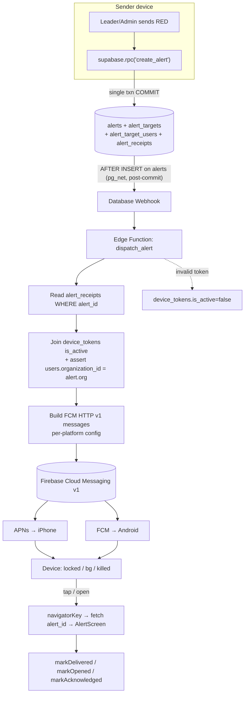
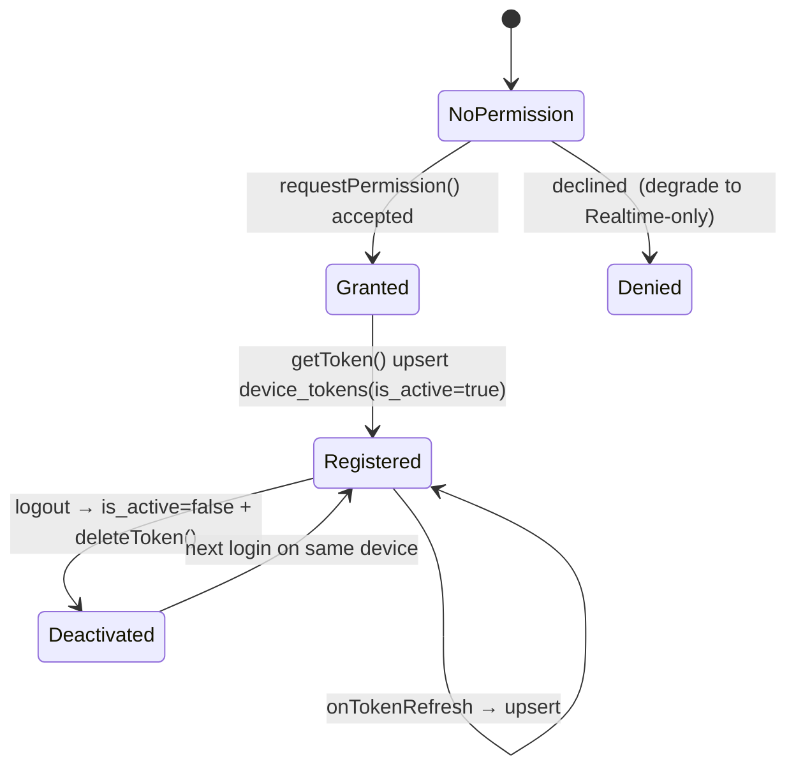
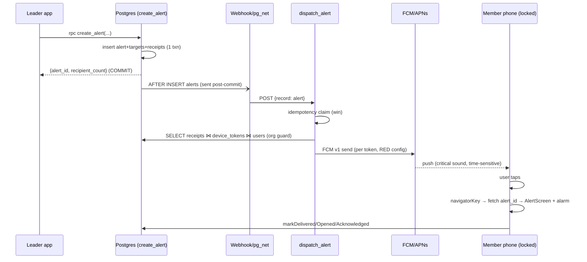

# KLYCH — Push Notifications Architecture Review (Post-RPC)

**Analysis & design only. No code, schema, configuration, or Edge Functions were
created.** Platforms in scope: **iOS (APNs)** and **Android (FCM)**.

This is the deep architecture design that builds on two things now true in the
codebase:
1. Alert creation is **atomic** (`create_alert` RPC, commit `87d1abf`) — `alerts`
   and `alert_receipts` commit in one transaction.
2. The earlier `push_notifications_readiness_report.md` inventory still holds
   (device_tokens table, Firebase deps/configs present, no runtime wiring). This
   document does **not** repeat that inventory; it designs the system on top of it.

---

## 0. What the atomic RPC changes for push (the key unlock)

Before the RPC, a server dispatcher hooked to `alerts INSERT` could observe an
alert with **zero receipts** (children were written in later, separate requests).
That forced either polling, retries, or recomputation.

After the RPC, the trigger is **safe by construction**:

| Property | Pre-RPC | Post-RPC |
|----------|---------|----------|
| `alert_receipts` exist when `alerts INSERT` is visible | Not guaranteed | **Guaranteed** (same transaction) |
| Webhook can read receipts immediately | Race | **Safe** |
| Orphan alert (no receipts) can trigger a push | Possible | **Impossible** (zero recipients rolls back) |
| Recipient set authoritative | Eventually | **At commit** |

⇒ The dispatcher can treat `alert_receipts` as the single, immediately-correct
source of truth and needs **no race mitigation**. This removes the biggest risk
called out in the readiness report.

---

## 1. Target topology



Two delivery channels coexist (by design, not redundancy to be removed):
- **Supabase Realtime** (existing) — drives the in-app looping siren + full-screen
  `AlertScreen` while the app is **foregrounded** (`alert_realtime_listener.dart`).
- **Push (new)** — the only channel that works when **backgrounded / locked /
  killed**. §6 defines how the two are de-duplicated.

---

## 2. Trigger mechanism — decision

Three viable triggers; recommendation and rationale:

| Option | Mechanism | Pros | Cons | Verdict |
|--------|-----------|------|------|---------|
| **A. Database Webhook on `alerts` INSERT** | Supabase-managed `pg_net` AFTER INSERT trigger → HTTP to Edge Function | Decoupled; standard; **now safe post-RPC**; no app coupling | Fires per alert row; needs idempotency guard on retry | **Recommended** |
| B. `pg_net` call inside `create_alert` (after receipts) | RPC enqueues the dispatch itself | Fires only after receipts in the exact function; explicit | Couples send logic to push infra; harder to disable/feature-flag; still post-commit via pg_net | Fallback |
| C. Realtime Broadcast / queue table + worker | Worker polls a queue | Full control, retry-friendly | More moving parts; reintroduces latency | Overkill for now |

**Choose A.** `pg_net` dispatches the HTTP request **after commit**, so even
though the AFTER-INSERT trigger fires mid-transaction (right after the `alerts`
row insert, before receipts within the function), the actual HTTP send happens
post-commit when receipts are present. The webhook payload only needs the alert
row (`id`, `organization_id`, `level`); the dispatcher reads receipts itself.

> **Idempotency requirement (important):** Webhooks can be retried (network
> blips, function timeouts) → the same alert could be dispatched twice. The
> dispatcher must be idempotent. This is the **one additive schema change** the
> implementation will need (analysis flag, not done here): either
> `alerts.push_dispatched_at timestamptz` (claim-once via
> `UPDATE alerts SET push_dispatched_at = now() WHERE id = $1 AND push_dispatched_at IS NULL RETURNING id`)
> or a `push_dispatch_log(alert_id PK, dispatched_at)` table. The dispatcher
> proceeds only if it wins the claim. FCM-level dedup is additionally provided by
> a per-alert collapse/dedup key, but the DB claim is the authoritative guard.

---

## 3. Dispatcher (Edge Function `dispatch_alert`) — design

Runtime: Supabase Edge Function (Deno/TS). Secrets: `SUPABASE_SERVICE_ROLE_KEY`,
Firebase **service-account JSON** (for FCM v1 OAuth2). Never in the app.

Algorithm:
```
1. Verify request authenticity (webhook secret header) → reject otherwise.
2. Parse payload.record → alertId, orgId, level, isTest.
3. Idempotency claim (see §2). If not won → 200 (already dispatched), stop.
4. recipients =
     SELECT r.user_id, t.token, t.platform
     FROM alert_receipts r
     JOIN device_tokens t ON t.user_id = r.user_id AND t.is_active
     JOIN users u        ON u.id = r.user_id
     WHERE r.alert_id = alertId
       AND u.organization_id = orgId          -- cross-org guard (defence in depth)
       AND u.is_disabled = false.
5. If empty → 200 (nothing to send; valid for all-recipients-tokenless), stop.
6. Mint FCM v1 OAuth2 access token (cache ~55 min).
7. Build one message per token with per-platform config (§5), batched.
8. Send (HTTP v1 /messages:send, concurrency-limited).
9. Per response:
     - success → optionally record delivery attempt
     - UNREGISTERED / INVALID_ARGUMENT(token) → device_tokens.is_active=false
     - 429 / 5xx → retry with backoff (bounded); leave token active
10. Return 200 with a summary {sent, failed, deactivated}.
```

Notes:
- **Source of truth = `alert_receipts`** (Option A from the pipeline audit). The
  pure UNION resolver (`resolveFromTargetRows`) can be ported to TS as a
  **backstop/self-check**, but receipts are authoritative and already correct.
- **No fan-in to a single multicast topic** — KLYCH targets specific users, so we
  send to explicit tokens (token-addressed), not topics. Topics cannot express
  department/status/group/user UNION targeting safely within org isolation.

---

## 4. Token lifecycle (`PushService` + `DeviceTokenService`) — design

State machine for a device's token:



Design points:
- **iOS ordering:** must obtain the **APNs token** before the FCM token
  (`getAPNSToken()` may return null right after launch; await it / retry) — a
  common iOS pitfall. FlutterFire’s `getToken()` returns the FCM token used for
  both platforms once APNs is linked in Firebase.
- **Upsert keying:** schema already has `UNIQUE(token)` and `UNIQUE(user_id,
  token)` → upsert on conflict; one row per (user, device). `platform` from the
  running OS.
- **Logout (3 handlers today):** on `signOut`, set this device's token
  `is_active=false` **and** `FirebaseMessaging.deleteToken()` so a shared/reassigned
  device never receives the previous user's alerts (security item M10).
- **Reassignment:** because `UNIQUE(token)` is global, if device D’s token later
  registers under user B, the upsert moves ownership; the dispatcher’s
  `is_active` + org join prevents stale targeting.

---

## 5. Message contract (FCM HTTP v1) — per platform

Single `data` payload (routing) + platform-specific presentation. RED is the
emergency path; GREEN is informational.

```jsonc
{
  "message": {
    "token": "<device token>",
    "data": {
      "alert_id": "<uuid>",
      "level": "RED",                 // or GREEN
      "organization_id": "<uuid>",
      "type": "klych_alert"
    },
    "notification": {                 // shown by OS when bg/killed
      "title": "🚨 ТРИВОГА",          // RED;  GREEN → "Інформація"
      "body": "<alert message>"
    },
    "android": {
      "priority": "high",
      "notification": {
        "channel_id": "klych_red",    // high-importance; GREEN → "klych_info"
        "sound": "alarm",             // custom raw resource
        "visibility": "public",
        "notification_priority": "PRIORITY_MAX"
        // Phase 3: full-screen intent to show AlertScreen over lockscreen
      }
    },
    "apns": {
      "headers": {
        "apns-priority": "10",
        "apns-push-type": "alert"
      },
      "payload": {
        "aps": {
          "sound": { "critical": 1, "name": "alarm.caf", "volume": 1.0 }, // RED (needs Critical Alerts entitlement)
          "interruption-level": "critical",   // RED; GREEN → "active"
          "content-available": 1              // wake app to mark delivered (best-effort)
        }
      }
    }
  }
}
```

**Honest platform constraints (must shape expectations):**
- **iOS cannot auto-launch a full-screen siren UI from a push** while
  locked/killed. The strongest emergency behavior is **Critical Alerts**
  (bypasses mute/DND, loud sound) + **Time Sensitive/critical interruption
  level**. The full-screen `AlertScreen` + looping alarm appears **when the user
  taps/opens** the notification. Critical Alerts requires a **special Apple
  entitlement request** (lead time).
- **Android can** approximate the in-app behavior via a **full-screen intent**
  high-importance notification that launches `AlertScreen` over the lockscreen,
  plus a custom looping sound. Closer to a true “siren”.
- `content-available`/data-only background delivery on iOS is **throttled and not
  guaranteed** → use it only for best-effort `delivered_at`, never as the primary
  delivery signal.

---

## 6. De-duplication: Realtime vs Push (critical correctness)

A foregrounded recipient receives **both** the Realtime INSERT and the push. Only
**one** siren/`AlertScreen` may fire per `alert_id`.

Current dedup is in-memory per screen: `AlertDeliveryTracker.tryMarkProcessed`
(`alert_realtime_listener.dart:61`). Design:

| App state | Active channel | Handling |
|-----------|----------------|----------|
| Foreground | Realtime (already mounted) | Realtime handles it. `onMessage` (foreground push) must route through the **same** `AlertDeliveryTracker` so the push is dropped if the id was already processed. |
| Background | Push | OS shows notification; on tap → route to `AlertScreen`. |
| Killed | Push | `getInitialMessage()` on cold start → route after auth resolves. |

Recommendation: promote `AlertDeliveryTracker` to a **process-wide singleton**
keyed by `alert_id` (it already supports id-based dedup) and have both the
Realtime callback and the foreground `onMessage` handler consult it. This
guarantees exactly-once in-app presentation regardless of channel ordering.

---

## 7. Notification-tap routing — design

`main.dart` today uses `home: FutureBuilder(...)` with **no `navigatorKey` and no
named routes**. Background/cold-start routing needs a global navigator.

Design:
- Add a global `navigatorKey` to `MaterialApp`.
- Wire the four FCM entry points:
  - `onMessage` → foreground (dedup via §6).
  - `onMessageOpenedApp` → app in background, user tapped.
  - `getInitialMessage()` → app was killed, launched by tap (handle **after**
    `Supabase` session + role are resolved — reuse the existing `_getStartScreen`
    gating so we never route an unauthenticated user into `AlertScreen`).
  - `onBackgroundMessage` (top-level isolate entrypoint) → best-effort
    `delivered_at`, no UI.
- Routing payload uses `data.alert_id`; the handler **fetches the alert row** (now
  guaranteed committed) and pushes `AlertScreen` with the alarm player, mirroring
  `triggerRedAlert`.
- **Org/auth guard at routing time:** verify the logged-in user belongs to
  `data.organization_id`; ignore otherwise (defence against stale tokens).

---

## 8. Security model

Carry forward the readiness report’s findings, sharpened for the dispatcher:

| Concern | Design requirement |
|---------|--------------------|
| **`device_tokens` open (RLS disabled)** | **Hard prerequisite:** enable owner-only RLS (`auth.uid() = user_id` for select/insert/update/delete) **before** any token is written. This is the single most important gate. |
| Dispatcher privilege | Edge Function uses **service-role key** (bypasses RLS) — kept as a function secret only. |
| Cross-org leakage | Dispatcher joins `device_tokens → users` and filters `users.organization_id = alert.organization_id`. A push is never addressed outside the alert’s org, even if receipts/tokens were tampered. |
| FCM credentials | Firebase service-account JSON only as a function secret; never shipped in the app; client calls nothing privileged. |
| Token theft on shared device | Logout deactivates token + `deleteToken()` (§4). |
| Replay / spoofed webhook | Validate a shared webhook secret header in the Edge Function; reject unknown callers. |
| `create_alert` hardening | When RLS lands, switch the RPC to `security definer` + assert caller is an admin/leader in `p_organization_id` (already flagged in `atomic_alert_rpc_plan.md`). Prevents forged sends that would fan out as pushes. |

---

## 9. Observability & failure handling

- **Dispatcher logs (structured):** `alert_id`, counts `{recipients, sent,
  failed, deactivated}`, latency, FCM error codes. No PII beyond user ids.
- **Token hygiene:** `UNREGISTERED`/invalid → `is_active=false` immediately;
  periodic cleanup job for long-inactive tokens.
- **Retry:** bounded exponential backoff on 429/5xx per message; the DB
  idempotency claim prevents whole-alert re-dispatch on webhook retry.
- **Delivery metrics:** compare `alert_receipts.delivered_at` vs
  `acknowledged_at` per alert to surface unreachable recipients to leaders
  (feeds a Phase-3 escalation feature).
- **Graceful degradation:** if `Firebase.initializeApp` or token registration
  fails, the app must continue to work on **Realtime-only** (feature-flagged) —
  no regression for existing users.

---

## 10. End-to-end sequence (RED, recipient phone locked)



---

## 11. Required schema deltas (for the future implementation, not now)

Push is **mostly additive**, but the design needs exactly these DB changes when
implementation begins (all additive, no rewrite of existing logic):

1. **RLS on `device_tokens`** (owner-only) — security gate. *(Required)*
2. **Idempotency marker** — `alerts.push_dispatched_at` column **or**
   `push_dispatch_log` table. *(Required for safe retries)*
3. (Optional) RLS policies for the rest of the tables before public launch.

No change to `alerts`/`alert_targets`/`alert_target_users`/`alert_receipts`
shape, to `create_alert`, or to the Realtime publication.

---

## 12. Effort & risk delta vs the prior readiness report

The atomic RPC **lowers** the risk profile previously documented:

| Area | Prior report | Now |
|------|--------------|-----|
| Dispatcher trigger safety | Needed race mitigation / polling | **Solved** — webhook on INSERT is safe |
| Source of truth | “receipts created at send time” (true but racy on read) | **Authoritative at commit** |
| Recipient logic duplication | Port resolver to TS | Receipts are correct; resolver port = optional backstop |
| New blockers introduced | — | None |

Phase estimates from the readiness report still apply (Phase 0 prereqs ~1d;
Phase 1 MVP ~3–5d; Phase 2 production ~5–8d; Phase 3 advanced ~1–2w+). The RPC
work has effectively **retired the hardest correctness risk** in Phase 1.

---

## 13. Open decisions for the team (need a call before implementation)

1. **iOS Critical Alerts** — pursue the Apple entitlement (true mute/DND bypass,
   long lead time) or ship Time-Sensitive first? Recommendation: ship
   Time-Sensitive in Phase 1–2, submit Critical Alerts request in parallel.
2. **Bundle id** — align Android `applicationId` (`com.example.alert_app`) to
   `com.klych.app` before FCM registration (carried from readiness M9).
3. **Idempotency mechanism** — `push_dispatched_at` column (simplest) vs log
   table (more auditable). Recommendation: column.
4. **delivered_at on push** — accept best-effort iOS background delivery, or only
   mark delivered on open? Recommendation: best-effort + mark on open.
5. **Feature flag** — global remote flag to enable push per org during pilot.

---

## Final recommendation

**Architecture is approved and de-risked by the atomic RPC.** Proceed with the
topology in §1 using: Database Webhook on `alerts INSERT` (§2) → `dispatch_alert`
Edge Function reading `alert_receipts` as source of truth (§3) → FCM HTTP v1 with
per-platform config (§5) → global-navigator tap routing (§7), gated by the two
required prerequisites: **owner-only RLS on `device_tokens`** and a **dispatch
idempotency marker** (§11). The existing Realtime path stays as the foreground
channel, de-duplicated via a shared `AlertDeliveryTracker` (§6).

No implementation performed — this document is the design basis for the
subsequent Push Phase 0/1 work.
