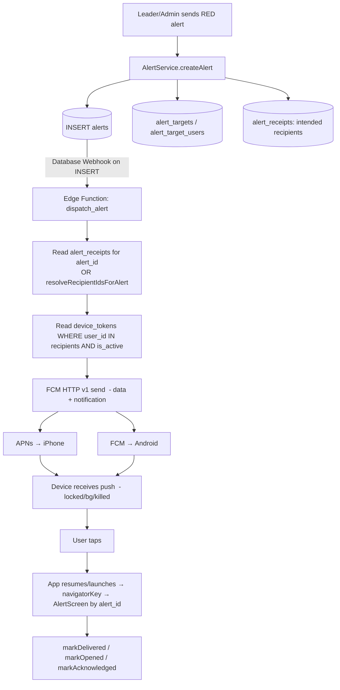

# KLYCH — Push Notifications Readiness Audit & Roadmap

**Audit only. No code, schema, or configuration was modified.**
Date: 2026-06-04 · Scope: full `lib/`, `supabase/`, `ios/`, `android/` review.

Goal under evaluation: deliver a **system-level push notification** for RED alerts
that reaches recipients when the app is **closed, backgrounded, or the phone is
locked** — something the current architecture cannot do.

---

## 1. Current readiness score

### Score: **45 / 100 — "Strong foundation, integration layer not started"**

| Layer | Weight | State | Score |
|-------|--------|-------|-------|
| Data model (alerts / targets / receipts / `device_tokens`) | 25 | Complete, push-ready | 25 |
| Recipient resolution (reusable, server-portable logic) | 15 | Complete (client-side) | 12 |
| Firebase/native scaffolding present | 15 | Partial (configs yes, wiring no) | 7 |
| FCM/APNs runtime integration (Dart) | 20 | **Absent** | 0 |
| Server-side dispatch (Edge Function / fan-out) | 15 | **Absent** | 0 |
| Notification-tap routing / background handlers | 10 | **Absent** | 1 |

**Interpretation:** The hard architectural problems (targeting, receipts,
recipient resolution, alert pipeline) are already solved. What remains is almost
entirely **additive integration work** — there are no architectural blockers, but
there is also *zero* working push code today. Alerts currently arrive **only via
Supabase Realtime while a role home screen is mounted and the WebSocket is live**
(i.e. app effectively foregrounded). Background/killed delivery does not exist.

---

## 2. Existing infrastructure already available

These assets are in place and **reusable as-is**:

### Dependencies (`pubspec.yaml`)
```18:19:lib/../pubspec.yaml
  firebase_core: ^3.15.2
  firebase_messaging: ^15.2.10
```
`assets_audio_player` (alarm) and `vibration` are also present and already used by
the in-app RED alert.

### Native configuration (already committed)
| Item | Path | State |
|------|------|-------|
| Android Firebase config | `android/app/google-services.json` | Present (project `alert-app-0700`) |
| iOS Firebase config | `ios/Runner/GoogleService-Info.plist` | Present |
| FlutterFire options | `lib/firebase_options.dart` | Generated (Android + iOS) |
| iOS background mode | `ios/Runner/Info.plist:52` | `UIBackgroundModes = [remote-notification]` ✅ |
| iOS plugin registrant | pulls `FLTFirebaseMessagingPlugin` | Present |

### Database (Supabase v2 — `supabase/v2/schema.sql`)
- **`device_tokens` table already designed** (the exact table FCM needs):
```267:276:supabase/v2/schema.sql
CREATE TABLE device_tokens (
  id          uuid PRIMARY KEY DEFAULT gen_random_uuid(),
  user_id     uuid NOT NULL REFERENCES users(id) ON DELETE CASCADE,
  token       text NOT NULL,
  platform    text NOT NULL CHECK (platform IN ('ios', 'android', 'web')),
  is_active   boolean NOT NULL DEFAULT true,
  updated_at  timestamptz NOT NULL DEFAULT now(),
  CONSTRAINT device_tokens_token_unique UNIQUE (token),
  CONSTRAINT device_tokens_user_token_unique UNIQUE (user_id, token)
);
```
- `alerts`, `alert_targets`, `alert_target_users`, `alert_receipts` fully modeled;
  `level` ∈ `{RED, GREEN}`.
- Realtime publication already includes `alerts`, `alert_receipts`, `users`.

### Reusable recipient resolution (the most valuable asset)
A single, deterministic function already resolves the final recipient set from a
persisted alert — this is exactly what a server dispatcher must call:
```dart
// lib/services/alert_delivery_service.dart
static Future<Set<String>> resolveRecipientIdsForAlert({
  required String alertId,
  required String organizationId,
});
static Set<String> resolveFromTargetRows({ ... }); // pure function, server-portable
```
Targeting uses **UNION** semantics across organization / department / status /
group / explicit users, with the sender excluded. Receipts are created at send
time (`AlertReceiptService.createReceiptsForAlert`), so **the intended recipient
list already exists in `alert_receipts` the instant an alert is inserted** — a
dispatcher can simply read it.

### Alert trigger point
Every alert is a single `INSERT` into `public.alerts` (`AlertService.createAlert`).
That row is the natural, reliable hook for a server-side push dispatcher
(Database Webhook / Edge Function).

---

## 3. Missing components

| # | Missing piece | Where it belongs | Severity |
|---|---------------|------------------|----------|
| M1 | `Firebase.initializeApp(...)` is never called | `lib/main.dart` | Blocker |
| M2 | No FCM token retrieval/refresh, no permission request | new `PushService` | Blocker |
| M3 | No code writes/reads `device_tokens` | new `DeviceTokenService` | Blocker |
| M4 | No server-side dispatcher (no `supabase/functions/`) | Supabase Edge Function | Blocker |
| M5 | No `FirebaseMessaging.onBackgroundMessage`, `onMessage`, `onMessageOpenedApp`, `getInitialMessage` handlers | `lib/main.dart` + `PushService` | Blocker |
| M6 | No global `navigatorKey` / deep-link routing to `AlertScreen` from a tapped notification or cold start | `MaterialApp` + nav layer | Blocker |
| M7 | iOS: no `Runner.entitlements` with `aps-environment`; Push Notifications capability not enabled; APNs auth key not configured in Firebase | Xcode / Apple Developer / Firebase console | Blocker (iOS) |
| M8 | Android: `com.google.gms.google-services` Gradle plugin not applied; no `POST_NOTIFICATIONS` permission; no high-importance notification channel; no custom alarm sound resource | `android/` | Blocker (Android) |
| M9 | Bundle/app-id mismatch: `firebase_options.dart`/iOS use `com.klych.app`, but Android `applicationId = com.example.alert_app` | `android/app/build.gradle.kts:24` | High |
| M10 | No token cleanup on logout (no `device_tokens` deactivate, no `FirebaseMessaging.deleteToken`) | logout handlers (3 screens) | High (security) |
| M11 | **RLS is disabled on all tables, including `device_tokens`** | `supabase/v2/schema.sql:341-348` | High (security) |
| M12 | `delivered_at` is only written by the foreground Flutter client; push delivery won't update it | dispatcher / data-only push handler | Medium |
| M13 | Admin test alert path uses a local `AlertDialog`, not `AlertScreen`; inconsistent with push routing | `lib/screens/home_screen.dart` | Low |

---

## 4. Recommended architecture (FCM + APNs via Supabase)

### Topology


### Why this shape
- **Trigger:** Supabase **Database Webhook** (or `pg_net`) on `alerts INSERT` →
  Edge Function. Keeps fan-out server-side; client never holds FCM server creds.
- **Recipients:** the dispatcher reads the already-written `alert_receipts` rows
  (fastest, guaranteed-consistent with in-app delivery) — no logic duplication.
  `resolveRecipientIdsForAlert`'s pure helper can be ported to TS as a backstop.
- **Send API:** **FCM HTTP v1** with a Google service-account key (covers both
  Android via FCM and iOS via APNs once the APNs key is uploaded to Firebase).
- **Payload:** send **both** a `notification` block (so the OS shows it when
  killed) **and** a `data` block carrying `alert_id`, `level`, `organization_id`
  so the app can fetch the full alert and route. For RED use
  high priority + a custom critical sound.

### Required packages
- Already present: `firebase_core`, `firebase_messaging`.
- Add (Phase 2+): `flutter_local_notifications` (Android channel + custom sound,
  foreground display, heads-up), optionally `firebase_messaging`'s background
  isolate entrypoint. No other Dart deps strictly required.

### Required app capabilities / keys / certs
| Platform | Requirement |
|----------|-------------|
| iOS | Push Notifications capability + Background Modes (Remote notifications) in Xcode; `Runner.entitlements` with `aps-environment`; **APNs Auth Key (.p8)** uploaded to Firebase; matching App ID with Push enabled |
| iOS (optional) | **Critical Alerts** entitlement (special Apple approval) to bypass silent/DND for true emergencies |
| Android | `google-services` Gradle plugin; `google-services.json` (present); `POST_NOTIFICATIONS` permission (Android 13+); high-importance notification channel |
| Server | Firebase service-account JSON stored as Supabase secret; Edge Function env (`SUPABASE_SERVICE_ROLE_KEY`, FCM creds) |

### Required Supabase integration
- Enable a **Database Webhook** on `public.alerts` (INSERT) → `dispatch_alert`.
- Add `device_tokens` to client read/write path (with RLS — see §7).
- Store Firebase service-account + service-role key as **function secrets**, never in the app.

---

## 5. Security review

| Risk | Finding | Recommendation |
|------|---------|----------------|
| **RLS disabled everywhere** | `schema.sql:341-348` explicitly defers RLS; the app ships a `publishable`/anon key with broad table access. `device_tokens` would be world-readable/writable. | Before storing tokens, enable RLS on `device_tokens`: a user may insert/update/select **only their own** rows (`auth.uid() = user_id`). Plan org-scoped RLS for the rest before production. |
| **Cross-org push leakage** | Recipients are resolved from `alert_receipts`/targets which are themselves org-scoped at write time; the dispatcher must still re-assert `device_tokens.user_id ∈ recipients` and that each recipient's `organization_id` matches the alert's. | Dispatcher joins `device_tokens → users` and filters `users.organization_id = alerts.organization_id`. A push must never be addressed to a token outside the alert's org. |
| **FCM server credentials** | Must never live in the Flutter app. | Keep service-account/service-role keys only as **Edge Function secrets**; client calls nothing privileged. |
| **Token lifecycle / logout** | No token cleanup on `signOut` (3 logout handlers). A reassigned/shared device could keep receiving another user's alerts. | On logout: set `is_active=false` (or delete) for this device's token **and** call `FirebaseMessaging.deleteToken()`. On `onTokenRefresh`, upsert. |
| **Token rotation** | None today. | Upsert on `onTokenRefresh`; rely on `UNIQUE(token)` and `UNIQUE(user_id, token)` constraints already in schema. |
| **Hardcoded keys** | `main.dart:18-20` embeds the live Supabase URL + publishable key. | Acceptable for a publishable key *iff* RLS is enforced; rotate if the repo is public, and gate access with RLS. |
| **Bundle-id mismatch** | iOS `com.klych.app` vs Android `com.example.alert_app`. | Align Android `applicationId` to the real bundle before registering FCM, or pushes/anti-abuse and store listings will be inconsistent. |

**Bottom line:** the single most important security prerequisite is **enabling RLS
on `device_tokens`** (owner-only) before any token is ever written.

---

## 6. Implementation roadmap

### Phase 0 — Prerequisites (no app features; do first)
- Align `applicationId`/bundle id to `com.klych.app` (M9).
- Apple: enable Push capability, add entitlements, generate + upload APNs `.p8` to Firebase (M7).
- Android: apply `google-services` plugin, add `POST_NOTIFICATIONS` (M8).
- Supabase: enable **RLS on `device_tokens`** (owner-only) (M11).
- **Complexity: Low–Med · Risk: Low · Effort: ~1 day** (mostly console/Xcode).

### Phase 1 — Minimal working push (proof of delivery)
- `Firebase.initializeApp` in `main.dart` (M1).
- `PushService`: request permission, get token, upsert into `device_tokens`,
  handle `onTokenRefresh` (M2, M3).
- Edge Function `dispatch_alert`: triggered by `alerts` webhook → read recipients
  from `alert_receipts` → read active tokens → FCM HTTP v1 send (M4).
- Foreground/notification handlers minimally wired (M5).
- **Goal:** a RED alert produces a real system notification on a locked phone.
- **Complexity: Med · Risk: Med (APNs/cert friction) · Effort: ~3–5 days.**

### Phase 2 — Production-ready
- Global `navigatorKey` + cold-start (`getInitialMessage`) and
  `onMessageOpenedApp` routing → fetch alert by `alert_id` → `AlertScreen` (M6).
- `flutter_local_notifications`: Android high-importance channel, custom alarm
  sound, foreground heads-up; consistent RED vs GREEN behavior (M8).
- Logout token deactivation + `deleteToken` (M10).
- Mark `delivered_at` on push receipt via background data handler (M12).
- Retry/cleanup of stale tokens in dispatcher; structured logging.
- **Complexity: Med–High · Risk: Med · Effort: ~5–8 days.**

### Phase 3 — Advanced emergency behavior
- iOS **Critical Alerts** entitlement (bypass mute/DND) — requires Apple approval.
- Full-screen intent / persistent looping alarm until acknowledged (Android
  full-screen notification; iOS time-sensitive/critical).
- Delivery/ack analytics surfaced to leaders; escalation if unacknowledged.
- Per-user notification preferences without weakening RED emergencies.
- **Complexity: High · Risk: High (platform policy/approval) · Effort: ~1–2+ weeks.**

---

## 7. Testing strategy

1. **Unit/pure logic:** port + test the recipient resolver in the Edge Function
   against the existing Dart expectations (`test/alert_delivery_service_test.dart`
   already encodes UNION semantics — mirror those cases server-side).
2. **Token lifecycle:** login → token row appears (correct `user_id`/`platform`);
   logout → `is_active=false`; refresh → single row per device.
3. **Delivery matrix (real devices):** foreground / background / locked / killed,
   for each target type (org, department, status, group, individual user) — verify
   only intended users receive it and the count matches `alert_receipts`.
4. **Routing:** tap notification from killed state → app launches → correct
   `AlertScreen` for the right `alert_id`; ack writes `acknowledged_at`.
5. **iOS via TestFlight** (push cannot be fully tested on Simulator): requires a
   real device + APNs key + signed build.
6. **Security:** attempt to read/write another user's `device_tokens` with the
   anon key → must be denied by RLS; attempt cross-org push → dispatcher rejects.
7. **Regression:** confirm in-app Realtime path still works (push must augment, not
   replace, the existing flow).

---

## 8. Production rollout plan

1. **Phase 0 + 1 on a staging Supabase project** with internal test devices.
2. **Closed TestFlight + Android internal track** with a small pilot org; verify
   locked-screen RED delivery and ack analytics.
3. **Enable RLS broadly** (device_tokens first, then org-scoped policies) and
   re-run the security matrix.
4. **Gradual rollout**: feature-flag push so the app degrades gracefully to
   Realtime-only if FCM init fails (no regression for existing users).
5. **Monitoring**: dispatcher logs (sent/failed/invalid-token), token table growth,
   and `delivered_at` vs `acknowledged_at` rates per alert.
6. **App Store / Play submission**: include push-notification usage rationale;
   if pursuing Critical Alerts, submit the entitlement request early (long lead time).

---

## 9. Estimated effort

| Phase | Effort | Complexity | Primary risk |
|-------|--------|------------|--------------|
| Phase 0 (prereqs) | ~1 day | Low–Med | Apple cert/provisioning friction |
| Phase 1 (MVP push) | ~3–5 days | Med | APNs setup, first Edge Function |
| Phase 2 (production) | ~5–8 days | Med–High | Background routing, channels, sounds |
| Phase 3 (advanced) | ~1–2+ weeks | High | Apple Critical Alerts approval |

**Total to a production-ready RED push (Phases 0–2): ~2–3 weeks** of focused work,
dominated by platform/cert configuration and the dispatcher, not app rewrites.

---

## Final recommendation

### ✅ READY FOR PUSH IMPLEMENTATION — conditional on a short Phase 0

**Reasoning:** There are **no architectural blockers**. The data model
(`device_tokens`, `alerts`, `alert_receipts`), the single reliable trigger
(`alerts INSERT`), and the reusable, deterministic recipient resolution are all
already in place — these are the parts that are normally hard. The remaining work
is **net-new integration** (FCM init, token service, one Edge Function, tap
routing) rather than refactoring existing logic, so it can proceed safely without
touching business logic or schema (beyond adding RLS policies).

Before writing push code, complete the **Phase 0 prerequisites**, because two of
them are genuine correctness/security gates:
1. **Enable RLS on `device_tokens` (owner-only)** — never store tokens on an
   open table.
2. **Align the Android `applicationId` with the real bundle id** (`com.klych.app`).
3. Provision **APNs auth key + iOS Push capability/entitlements** (longest lead time).

With Phase 0 done, KLYCH can implement true emergency push notifications
incrementally and low-risk, augmenting (not replacing) the existing Realtime
delivery path.
