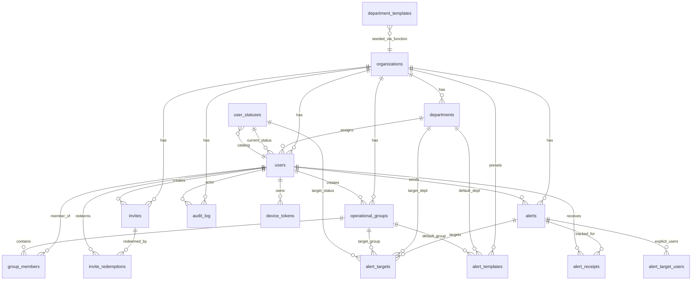

# KLYCH v2 — Schema Diagram

## Entity relationship overview



## Table groups

### Core tenancy

| Table | Purpose |
|-------|---------|
| `organizations` | Root tenant; one isolated org per unit |
| `users` | Profile + role + department + status |
| `departments` | Admin-managed categories |

### Reference catalogs (global)

| Table | Purpose |
|-------|---------|
| `user_statuses` | Valid status codes + labels |
| `department_templates` | Default names copied on org creation |

### Access control path

| Table | Purpose |
|-------|---------|
| `invites` | Admin-issued codes with role, expiry, usage limit |
| `invite_redemptions` | Audit trail of who used which invite |

### Operations

| Table | Purpose |
|-------|---------|
| `operational_groups` | Leader-created teams |
| `group_members` | Many-to-many users ↔ groups |

### Alerts pipeline

```
Sender (admin/leader)
    │
    ▼
 alerts ──► alert_targets (org | dept | group | status)
    │              │
    │              └──► alert_target_users (explicit users)
    │
    ├──► alert_receipts (delivered → opened → acknowledged)
    │
    └──► (optional) alert_templates as compose-time presets
```

### Alert templates

| Column | Purpose |
|--------|---------|
| `name` | Org-unique label (e.g. RED ALERT, Evacuation) |
| `level` + `message` | Pre-filled alert content |
| `default_target_type` | Optional preset targeting hint |
| `default_*` refs | Optional department/group/status defaults |

Templates do not send alerts; the app copies values into `alerts` + `alert_targets` on send.

### Compliance

| Table | Purpose |
|-------|---------|
| `audit_log` | Role changes, removals, invites, alerts, acks |

### Future integrations

| Table | Purpose |
|-------|---------|
| `device_tokens` | FCM push registration (`is_active`, globally unique `token`) |

## User model (four dimensions — no rank field)

```
┌─────────────────────────────────────────────────────────┐
│                         USER                            │
├─────────────┬─────────────┬─────────────┬───────────────┤
│    ROLE     │ DEPARTMENT  │   STATUS    │    GROUPS     │
│ admin       │ HQ          │ available   │ Night Team    │
│ leader      │ Medics      │ on_duty     │ Rapid Response│
│ member      │ Drivers     │ deployed    │ (0..n groups) │
│             │ (1 dept)    │ vacation    │               │
│             │             │ unavailable │               │
└─────────────┴─────────────┴─────────────┴───────────────┘
     auth           admin          self         leader
   (routing)      managed       managed       managed
```

**Rank excluded:** Authorization uses `role`; org structure uses `department`; `display_name` covers informal titles. A separate `rank` column would overlap role semantics and require per-org rank catalogs.

**Offline excluded from statuses:** Status is operational availability for targeting. Device presence uses `last_activity_at` (and future FCM/presence layer), not a sixth status code.

## Alert targeting resolution (future server-side)

| `target_type` | Resolution |
|---------------|------------|
| `organization` | All active users in org |
| `department` | Users where `department_id` matches |
| `group` | Users in `group_members` for `group_id` |
| `status` | Users where `status` matches `status_code` |
| `users` | Rows in `alert_target_users` for this alert |

Multiple `alert_targets` rows on one alert = **union** of recipient sets.

## Cross-org integrity (DB-enforced)

| Trigger | Validates |
|---------|-----------|
| `users_department_same_org` | User department belongs to user's org |
| `group_members_same_org` | Group member and group share org |
| `alert_targets_same_org` | Target dept/group belongs to alert org |
| `alert_target_users_same_org` | Explicit user belongs to alert org |
| `alert_templates_same_org` | Template default refs belong to template org |

## RLS readiness (future)

Direct `organization_id` policy on: `organizations`, `departments`, `users`, `invites`, `operational_groups`, `alerts`, `alert_templates`, `audit_log`.

Child tables via EXISTS join: `alert_targets`, `alert_target_users`, `group_members`, `invite_redemptions`, `device_tokens`, `alert_receipts`.

## Realtime subscriptions (prepared)

| Table | Event | Consumer |
|-------|-------|----------|
| `alerts` | INSERT | Members, leaders (filtered by org) |
| `users` | UPDATE | Leader/admin status dashboard |
| `alert_receipts` | INSERT/UPDATE | Leader/admin ack dashboard |

## Invite lifecycle

```
Admin creates invite
  role: member | leader
  expires_at, max_uses
        │
        ▼
User redeems code ──► invite_redemptions
        │              use_count++
        ▼
User row created with locked role
Member must pick department
```

## Breaking changes from v1

| v1 | v2 |
|----|-----|
| `users.permission` duplicate | Dropped — `role` only |
| `invites.permission` | Renamed to `invites.role` |
| `alerts.type` | Renamed to `alerts.level` (`RED`/`GREEN`) |
| `alerts.created_by` (auth uuid) | `alerts.sender_user_id` (users.id FK) |
| Inline targeting | `alert_targets` + `alert_target_users` |
| No receipts | `alert_receipts` |
| No audit | `audit_log` |
| No invite expiry | `expires_at`, `max_uses`, `revoked_at` |
